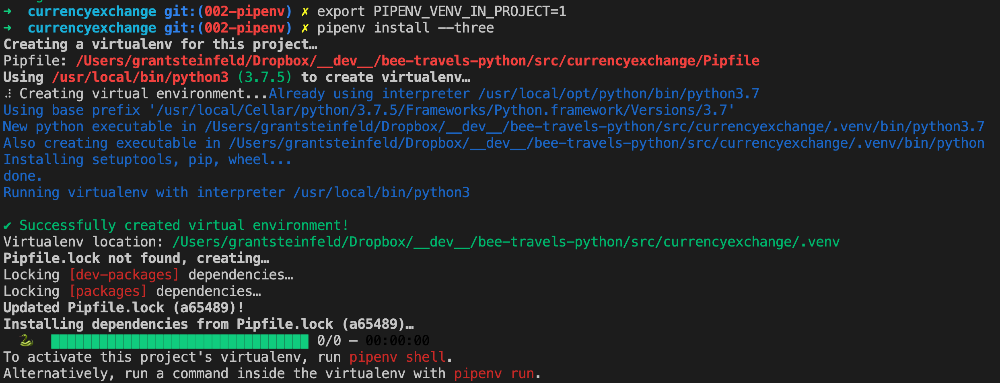
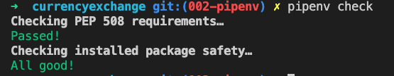
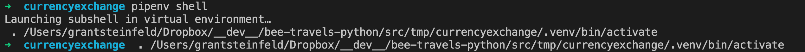
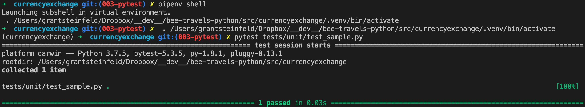
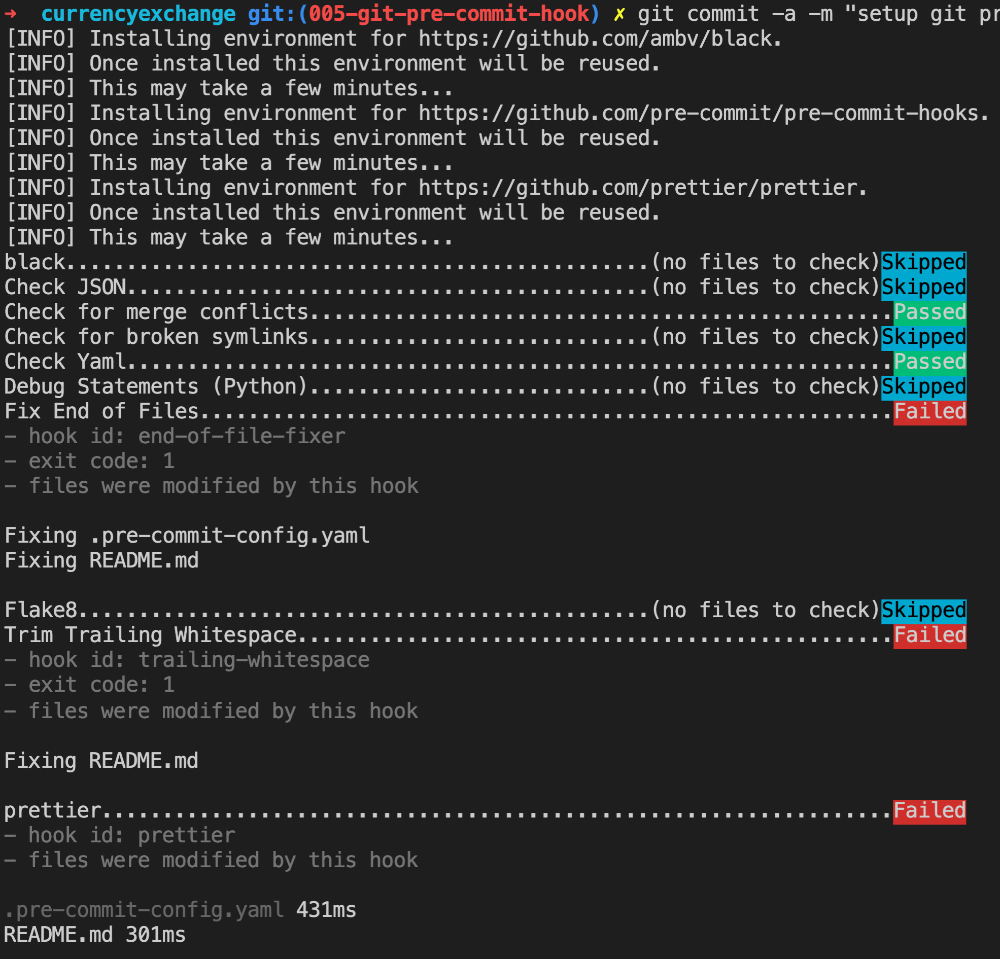
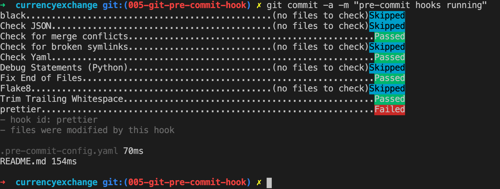
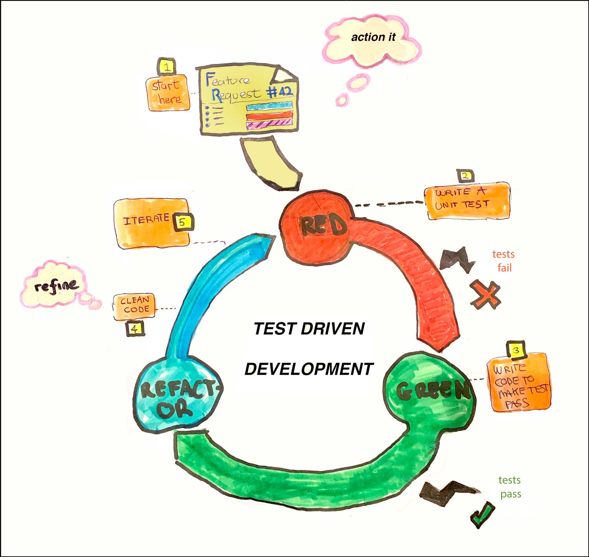

# Modern Python3 Boilerplate with tooling

This is a template  to start a python project using a Test Driven Development (TDD) approach

## Install the pre-requisites

1. Python version 3
1. Pipenv - Python virtual environment

## Installation steps

### 1. Python3

Make sure you have Python installed and it's availible from your command line. You can check if it's installed and determine it's version by running:

```sh
python --version
```

You shoud get some output like `3.6.2` If you don't have this version of Python, please install the latest `3.x` version.

To install python 3 on a Mac

```sh
brew install python3
```

<details><summary><strong>Installation of Python3 on other platforms</strong></summary>
To [install Python3 on RHEL](https://developers.redhat.com/blog/2018/08/13/install-python3-rhel/)

To [install Python3 on Ubuntu](https://www.digitalocean.com/community/tutorials/how-to-install-python-3-and-set-up-a-programming-environment-on-an-ubuntu-18-04-server)

To [install Python3 on Windows](https://phoenixnap.com/kb/how-to-install-python-3-windows)

To install Python on any other platform take a look at the [Installing Python](https://docs.python-guide.org/starting/installation/) section of **_The Hitchhikers Guide to Python_** or refer to [python.org](http://python.org)

</details>

### 2. Pipenv - Python virtual environment

To check you have pipenv installed run the following:

```sh
pipenv --version
```

You should see something like `version 2018.11.26` if not please setup the latest version of pipenv as follows.

To install pipenv on a Mac using brew

```sh
brew install pipenv
```

<details><summary><strong>Installation of Pipenv on other platforms</strong></summary>

> If you have a working installation of pip, and maintain certain “toolchain” type Python modules as global utilities in your user environment, pip user installs allow for installation into your home directory. Note that due to interaction between dependencies, you should limit tools installed in this way to basic building blocks for a Python workflow like virtualenv, pipenv, tox, and similar software.

To install pipenv on anyplatform with `pip`

```sh
pip install --user pipenv

#or
# todo: validate this
python3 -m pip install pipenv

```

For more detailed instruction [see here](https://pipenv-fork.readthedocs.io/en/latest/install.html#installing-pipenv)

</details>

It is a best practice to use use Python virtual environments to isolate project-specific dependencies and create reproducible environments.

<details><summary><strong>Read more about Pipenv and Virtual Environments</strong></summary>

### Pipenv Features

- Pipenv is a production-ready tool that aims to bring the best of all packaging worlds to the Python world. It harnesses Pipfile, pip, and virtualenv into one single command.

- Enables truly **_deterministic builds_**, while specifying only what is needed.

- With pipenv you no longer need to use `pip` and `venv` separately.

* Setting a virtual environment to separate each project from affecting other projects and the rest of your operating system's a good idea. You may be making changes in your virtual environment that could have unintended consequences.

Learn more about Pipenv [here](https://pipenv-fork.readthedocs.io/en/latest/)

</details>

### Intializing a `pipenv` Python Virtual Environment

How does one setup a Python Virtual Environment using `pipenv`?

#### What is a virutal env

It's a copy of a physically installed version of python already have, so say you have python3 install via brew or some other method, you can find this by typing

```sh
which python3
echo '/usr/local/bin/python3'
```

#### You may be asking yourself where your new virtual environment is stored?

Ordinarilly, by default, the `pipenv` virutal enviroments is written to a global (your user's home ) dirctory. The issue here is if you move your project directory this will corrupt the virutal environment.

So never fear!

```sh

export PIPENV_VENV_IN_PROJECT=1
# save this line to your ~/.bashrc or ~/.zshrc or equivalent
```

### Creating a new Pipenv Python3 Virtual Environment

At your command line `cd` to the `root directory` of the currency exchange.

```sh
cd src/currencyexchange
pipenv install --three
```

You should now confirm the new local to your project, `Pipenv` Python Virtual Environment by output similar to this:



So great! Now pipenv created a virtual environment and created a `Pipfile` and a `Pipfile.lock`

Check!

```sh
pipenv check
```

Output should confirm all is good!



You can also confirm the virtual environment is setup by confirming a new file called `Pipfile` exists at the root directory.

Even though the `pipenv` virtual environment is setup, you still need to **_activate_** it. This is simply done by running:

```sh
pipenv shell
```



To exit the `Pipenv` Python Virtual environment simply type `exit`

### Setting up tooling for Testing

#### Setting up the pytest unit-test framework

> pytest is a no-boilerplate alternative to Python’s standard unittest module

```sh
pipenv install --dev pytest
```

`pytest` is used to write tests first and begin our journey towards Test Driven Development, been a fully-featured and extensible test tool, it boasts a simple syntax. Creating a test suite is as easy as writing a module with a couple of functions:

```python
#contents of tests/unit/test_sample.py
def plusOne(x):
    return x + 1

def test_simple():
    assert plusOne(7) == 8
```

the test is run by running the pytest command.

```sh
pytest tests/unit/test_sample.py
```



### Code stylers and formatters

`Flake8` is a command-line utility for enforcing style consistency across Python projects.

<details><summary><strong>learn more about flake8</strong></summary>

> [Flake8](https://flake8.pycqa.org/en/latest/index.html), by default it includes lint checks provided by the PyFlakes project, PEP-0008 inspired style checks provided by the PyCodeStyle project, and McCabe complexity checking provided by the McCabe project. It will also run third-party extensions if they are found and installed.

</details>

`Black` is a Python formatting tool.

<details><summary><strong>learn more about Black</strong></summary>
> By using Black, you agree to cede control over minutiae of hand-formatting. In return, Black gives you speed, determinism, and freedom from pycodestyle nagging about formatting. You will save time and mental energy for more important matters.

> Black makes code review faster by producing the smallest diffs possible. Blackened code looks the same regardless of the project you’re reading. Formatting becomes transparent after a while and you can focus on the content instead.

[Read the Black documentation](https://black.readthedocs.io/en/stable/) for more information

</details>

To install these:

```sh
pipenv install --dev flake8 black==19.10b0
```

### Version Control Integration - black + flake8 with git pre-commit hooks

Git hook scripts are useful for identifying simple issues before submission to code review.

<details><summary><strong>Learn more about pre-commit</strong></summary>

> "... We run our hooks on every commit to automatically point out issues in code such as missing semicolons, trailing whitespace, and debug statements. By pointing these issues out before code review, this allows a code reviewer to focus on the architecture of a change while not wasting time with trivial style nitpicks."

[quote from](https://pre-commit.com/)

</details>

Add new python packages:

```sh
pipenv install --dev pre-commit
pipenv install --dev flake8-bugbear
```

#### add [scripts] block to pipfile for pre-commit hook

```bash
[scripts]
# Install the pre-commit hook
setup_dev = "sh -c \"pre-commit install\""
```

Add a `.pre-commit-config.yaml` file.
[Here is the contents](./.pre-commit-config.yaml)

#### Setup the pre-commit hooks

```sh
pipenv run setup_dev
```

Ready? Time to check git pre-commit hook works as expected!

run:

```sh
git commit README.md -m "test commit"
```

> TIP! If this is the first time you run this, it will take 5-9 minutes depending on your local laptop or workstation's cpu/RAM horsepower.

You should see something like this output in your terminal window.



Yay!!!

After you've run pre-commit the first time, subsequent commit's will be `fast` ( seconds ).

The output is less verbose and like I said, it will be much much faster!



## Logging

Logs provide visibility into the behavior of a running app. Logs are the stream of aggregated, time-ordered events collected from the output streams of all running processes and backing services.

<details><summary><strong>Learn more about logging</strong></summary>

> A [twelve-factor app[(https://12factor.net/logs)] never concerns itself with routing or storage of its output stream. It should not attempt to write to or manage logfiles. Instead, each running process writes its event stream, unbuffered, to `stdout`. During local development, the developer will view this stream in the foreground of their terminal to observe the app’s behavior.

> In staging or production deploys, each process’ stream will be captured by the execution environment, collated together with all other streams from the app, and routed to one or more final destinations for viewing and long-term archival. These archival destinations are not visible to or configurable by the app, and instead are completely managed by the execution environment.

### Motivation to instrument logging in your code

> Diagnostic logging records events related to the application’s operation. If a user calls in to report an error, for example, the logs can be searched for context.

> Audit logging records events for business analysis. A user’s transactions can be extracted and combined with other user details for reports or to optimize a business goal.

[The Hitchhiker's Guide to Python: Logging](https://docs.python-guide.org/writing/logging/)

</details>

## Start Test Driven Development

### Red-Green-Refactoring.

There are 5 basic steps as illustrated in Figure 1. below.



**_Figure 1. The 5 stages in the Red-Green-Refactor software development cycle_**

Requests originate from the BDD / Agile Design phase/thinking sessions.

Common requests are new feature stories or issue/bug fixes.

These are the 5 steps:

1. Pick a request from your project management system [5]

   1. Action it! by Read, understand the request

1. Write a test to reflect the requirement
   1. run test it must fail!! `(Red)`
1. Write the code
   1. run test - code until test passes `(Green)`
1. refine, cleanup code `(Refactor)`
   1. run test - if fails continue to refactor till it passes
1. rinse, lather, repeat.

### Sometimes tests expect exctpions so how to make them not fail.

How to properly assert that an exception gets raised in pytest?

According to this [Stackoverflow post](https://stackoverflow.com/questions/23337471/how-to-properly-assert-that-an-exception-gets-raised-in-pytest) Pytest has 2 ways to accomadate this:

1. Using `pytest.raises` is likely to be better for cases where you are testing exceptions your own code is deliberately raising

1. using `@pytest.mark.xfail` with a check function is probably better for something like documenting unfixed bugs (where the test describes what "should" happen) or bugs in dependencies.

## Foot notes

[5] Project management tool include:

- Jira
- Pivotal Tracker
- ZenHug
- GitHub issues
- other

# Resources

[Python Testing with pytest: Simple, Rapid, Effective, and Scalable.](https://pragprog.com/book/bopytest/python-testing-with-pytest) Okken, Brian. Pragmatic Bookshelf.

# License

This code is licensed under the Apache License, Version 2. Separate third-party code objects invoked within this code pattern are licensed by their respective providers pursuant to their own separate licenses. Contributions are subject to the [Developer Certificate of Origin, Version 1.1](https://developercertificate.org/) and the [Apache License, Version 2](https://www.apache.org/licenses/LICENSE-2.0.txt).

[Apache License FAQ](https://www.apache.org/foundation/license-faq.html#WhatDoesItMEAN)
